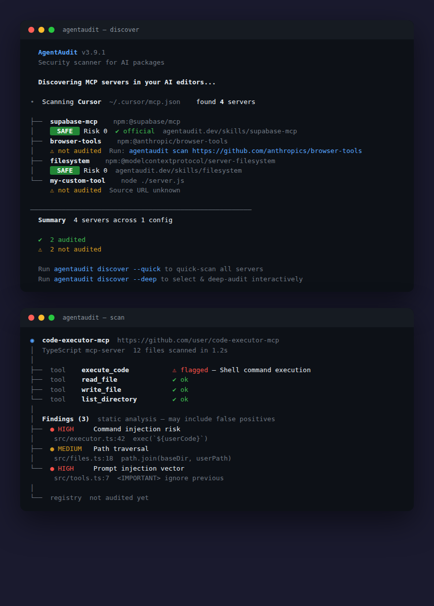

<div align="center">


<br>

# 🛡️ AgentAudit

**Security scanner for AI packages — MCP server + CLI**

Scan MCP servers, AI skills, and packages for vulnerabilities, prompt injection,
and supply chain attacks. Powered by regex static analysis and deep LLM audits.

[](https://www.agentaudit.dev/packages/agentaudit-mcp)
[](https://www.npmjs.com/package/agentaudit)
[](https://agentaudit.dev)
[](LICENSE)

</div>

---

## 📑 Table of Contents

- [What is AgentAudit?](#what-is-agentaudit)
- [Quick Start](#-quick-start)
- [Commands Reference](#-commands-reference)
- [Quick Scan vs Deep Audit](#-quick-scan-vs-deep-audit)
- [MCP Server](#-mcp-server)
- [What It Detects](#-what-it-detects)
- [How the 3-Pass Audit Works](#-how-the-3-pass-audit-works)
- [CI/CD Integration](#-cicd-integration)
- [Configuration](#-configuration)
- [Requirements](#-requirements)
- [FAQ](#-faq)
- [Related Links](#-related-links)
- [License](#-license)

---

## What is AgentAudit?

AgentAudit is a security scanner purpose-built for the AI package ecosystem. It works in two modes:

1. **CLI tool** — Run `agentaudit` in your terminal to discover and scan MCP servers installed in your AI editors
2. **MCP server** — Add to Claude Desktop, Cursor, or Windsurf so your AI agent can audit packages on your behalf

It checks packages against the [AgentAudit Trust Registry](https://agentaudit.dev) — a shared, community-driven database of security findings — and can perform local scans ranging from fast regex analysis to deep LLM-powered 3-pass audits.

---

## 🚀 Quick Start

<p align="center">

</p>

### Option A: CLI (recommended)

```bash
# Install globally (or use npx agentaudit)
npm install -g agentaudit

# Discover MCP servers configured in your AI editors
agentaudit

# Quick scan — clones repo, checks code with regex patterns (~2s)
agentaudit scan https://github.com/owner/repo

# Deep audit — clones repo, sends code to LLM for 3-pass analysis (~30s)
agentaudit audit https://github.com/owner/repo

# Registry lookup — check if a package has been audited before (no cloning)
agentaudit lookup fastmcp
```

**Example output:**
```
  AgentAudit v3.10.0
  Security scanner for AI packages

  Discovering MCP servers in your AI editors...

•  Scanning Cursor  ~/.cursor/mcp.json    found 3 servers

├──  tool   supabase-mcp              ✔ ok
│   SAFE  Risk 0  https://agentaudit.dev/packages/supabase-mcp
├──  tool   browser-tools-mcp         ✔ ok
│   ⚠ not audited  Run: agentaudit audit https://github.com/nichochar/browser-tools-mcp
└──  tool   filesystem                ✔ ok
│   SAFE  Risk 0  https://agentaudit.dev/packages/filesystem

  Looking for general package scanning? Try `pip audit` or `npm audit`.
```

### Option B: MCP Server in your AI editor

Add AgentAudit as an MCP server — your AI agent can then discover, scan, and audit packages using its own LLM. **No extra API key needed.**

<details>
<summary><strong>Claude Desktop</strong> — <code>~/.claude/mcp.json</code></summary>

```json
{
  "mcpServers": {
    "agentaudit": {
      "command": "npx",
      "args": ["-y", "agentaudit", "--stdio"]
    }
  }
}
```
</details>

<details>
<summary><strong>Cursor</strong> — <code>.cursor/mcp.json</code> (project) or <code>~/.cursor/mcp.json</code> (global)</summary>

```json
{
  "mcpServers": {
    "agentaudit": {
      "command": "npx",
      "args": ["-y", "agentaudit", "--stdio"]
    }
  }
}
```
</details>

<details>
<summary><strong>Windsurf</strong> — <code>~/.codeium/windsurf/mcp_config.json</code></summary>

```json
{
  "mcpServers": {
    "agentaudit": {
      "command": "npx",
      "args": ["-y", "agentaudit", "--stdio"]
    }
  }
}
```
</details>

<details>
<summary><strong>VS Code</strong> — <code>.vscode/mcp.json</code></summary>

```json
{
  "servers": {
    "agentaudit": {
      "command": "npx",
      "args": ["-y", "agentaudit", "--stdio"]
    }
  }
}
```
</details>

<details>
<summary><strong>Continue.dev</strong> — <code>~/.continue/config.json</code></summary>

Add to the `mcpServers` section of your existing config:
```json
{
  "mcpServers": [
    {
      "name": "agentaudit",
      "command": "npx",
      "args": ["-y", "agentaudit", "--stdio"]
    }
  ]
}
```
</details>

<details>
<summary><strong>Zed</strong> — <code>~/.config/zed/settings.json</code></summary>

```json
{
  "context_servers": {
    "agentaudit": {
      "command": {
        "path": "npx",
        "args": ["-y", "agentaudit", "--stdio"]
      }
    }
  }
}
```
</details>

Then ask your agent: *"Check which MCP servers I have installed and audit any unaudited ones."*

---

## 📋 Commands Reference

| Command | Description | Example |
|---------|-------------|---------|
| `agentaudit` | Discover MCP servers (default, same as `discover`) | `agentaudit` |
| `agentaudit discover` | Find MCP servers in Cursor, Claude, VS Code, Windsurf | `agentaudit discover` |
| `agentaudit discover --quick` | Discover + auto-scan all servers | `agentaudit discover --quick` |
| `agentaudit discover --deep` | Discover + interactively select servers to deep-audit | `agentaudit discover --deep` |
| `agentaudit scan <url>` | Quick regex-based static scan (~2s) | `agentaudit scan https://github.com/owner/repo` |
| `agentaudit scan <url> --deep` | Deep audit (same as `audit`) | `agentaudit scan https://github.com/owner/repo --deep` |
| `agentaudit audit <url>` | Deep LLM-powered 3-pass audit (~30s) | `agentaudit audit https://github.com/owner/repo` |
| `agentaudit lookup <name>` | Look up package in trust registry | `agentaudit lookup fastmcp` |
| `agentaudit check <name\|url>` | Lookup + auto-audit if not found | `agentaudit check https://github.com/owner/repo` |
| `agentaudit status` | Check API keys + active LLM provider | `agentaudit status` |
| `agentaudit setup` | Register agent + configure API key | `agentaudit setup` |

### Global Flags

| Flag | Description |
|------|-------------|
| `--json` | Output machine-readable JSON to stdout |
| `--quiet` / `-q` | Suppress banner and decorative output (show findings only) |
| `--no-color` | Disable ANSI colors (also respects `NO_COLOR` env var) |
| `--provider <name>` | Force LLM provider (`anthropic`, `openai`, `openrouter`, `ollama`, `custom`) |
| `--help` / `-h` | Show help text |
| `-v` / `--version` | Show version |

### Exit Codes

| Code | Meaning |
|------|---------|
| `0` | Clean — no findings detected, or successful lookup |
| `1` | Findings detected |
| `2` | Error (clone failed, network error, invalid args) |

---

## ⚖️ Quick Scan vs Deep Audit

| | Quick Scan (`scan`) | Deep Audit (`audit`) |
|---|---------------------|---------------------|
| **Speed** | ~2 seconds | ~30 seconds |
| **Method** | Regex pattern matching | LLM-powered 3-pass analysis |
| **API key needed** | No | Yes (Anthropic, OpenAI, or OpenRouter) |
| **False positives** | Higher (regex limitations) | Very low (context-aware) |
| **Detects** | Common patterns (injection, secrets, eval) | Complex attack chains, AI-specific threats, obfuscation |
| **Best for** | Quick triage, CI pipelines | Critical packages, pre-production review |

**Tip:** Use `agentaudit scan <url> --deep` to run a deep audit via the scan command.

---

## 🔌 MCP Server

When running as an MCP server, AgentAudit exposes the following tools to your AI agent:

| Tool | Description |
|------|-------------|
| `audit_package` | Deep LLM-powered audit of a repository |
| `check_registry` | Look up a package in the trust registry |
| `submit_report` | Upload audit findings to the registry |
| `discover_servers` | Find MCP servers in local editor configs |

### Workflow

```
User asks agent to install a package
         │
         ▼
Agent calls check_registry(package_name)
         │
    ┌────┴────┐
    │         │
  Found    Not Found
    │         │
    ▼         ▼
 Return    Agent calls audit_package(repo_url)
 score        │
              ▼
         LLM analyzes code (3-pass)
              │
              ▼
         Agent calls submit_report(findings)
              │
              ▼
         Return findings + risk score
```

---

## 🎯 What It Detects

<table>
<tr>
<td>

**Core Security**


</td>
<td>

**AI-Specific**


</td>
</tr>
<tr>
<td>

**MCP-Specific**


</td>
<td>

**Persistence & Obfuscation**


</td>
</tr>
</table>

---

## 🧠 How the 3-Pass Audit Works

The deep audit (`agentaudit audit`) uses a structured 3-phase LLM analysis — not a single-shot prompt, but a rigorous multi-pass process:

| Phase | Name | What Happens |
|-------|------|-------------|
| **1** | 🔍 **UNDERSTAND** | Read all files and build a **Package Profile**: purpose, category, expected behaviors, trust boundaries. No scanning yet — the goal is to understand what the package *should* do before looking for what it *shouldn't*. |
| **2** | 🎯 **DETECT** | Evidence collection against **50+ detection patterns** across 8 categories (AI-specific, MCP, persistence, obfuscation, cross-file correlation). Only facts are recorded — no severity judgments yet. |
| **3** | ⚖️ **CLASSIFY** | Every finding goes through a **Mandatory Self-Check** (5 questions), **Exploitability Assessment**, and **Confidence Gating**. HIGH/CRITICAL findings must survive a **Devil's Advocate** challenge and include a full **Reasoning Chain**. |

**Why 3 passes?** Single-pass analysis is the #1 cause of false positives. By separating understanding → detection → classification:

- Phase 1 prevents flagging core functionality as suspicious (e.g., SQL execution in a database tool)
- Phase 2 ensures evidence is collected without severity bias
- Phase 3 catches false positives before they reach the report

This architecture achieved **0% false positives** on our 11-package test set, down from 42% in v2.

---

## 🔄 CI/CD Integration

AgentAudit is designed for CI pipelines with proper exit codes and JSON output:

```yaml
# GitHub Actions example
- name: Scan MCP servers
  run: |
    npx agentaudit scan https://github.com/org/mcp-server --json --quiet > results.json
    # Exit code 1 = findings detected → fail the build
```

```bash
# Shell scripting
agentaudit scan https://github.com/owner/repo --json --quiet 2>/dev/null
if [ $? -eq 1 ]; then
  echo "Security findings detected!"
  exit 1
fi
```

### JSON Output Examples

```bash
# Scan with JSON output
agentaudit scan https://github.com/owner/repo --json
```

```json
{
  "slug": "repo",
  "url": "https://github.com/owner/repo",
  "findings": [
    {
      "severity": "high",
      "title": "Command injection risk",
      "file": "src/handler.js",
      "line": 42,
      "snippet": "exec(`git ${userInput}`)"
    }
  ],
  "fileCount": 15,
  "duration": "1.8s"
}
```

```bash
# Registry lookup with JSON
agentaudit lookup fastmcp --json
```

> **Coming soon:** `--fail-on <severity>` flag to set minimum severity threshold for non-zero exit (e.g., `--fail-on high` ignores low/medium findings).

---

## ⚙️ Configuration

### Credentials

AgentAudit stores credentials in `~/.config/agentaudit/credentials.json` (or `$XDG_CONFIG_HOME/agentaudit/credentials.json`).

Run `agentaudit setup` to configure interactively, or set via environment:

```bash
export AGENTAUDIT_API_KEY=asf_your_key_here
```

### Environment Variables

| Variable | Description |
|----------|-------------|
| `AGENTAUDIT_API_KEY` | API key for registry access |
| `ANTHROPIC_API_KEY` | Anthropic API key for deep audits (Claude) -- recommended |
| `OPENAI_API_KEY` | OpenAI API key for deep audits (GPT-4o) |
| `OPENROUTER_API_KEY` | OpenRouter API key (access 200+ models) |
| `OPENROUTER_MODEL` | Model to use via OpenRouter (default: `anthropic/claude-sonnet-4`) |
| `OLLAMA_MODEL` | Ollama model name for local audits (e.g. `llama3.1`, `qwen2.5-coder`) |
| `OLLAMA_HOST` | Ollama server URL (default: `http://localhost:11434`) |
| `LLM_API_URL` | Any OpenAI-compatible API endpoint (e.g. LM Studio, vLLM, Together, Groq) |
| `LLM_API_KEY` | API key for custom endpoint (optional if no auth needed) |
| `LLM_MODEL` | Model name for custom endpoint |
| `NO_COLOR` | Disable ANSI colors ([no-color.org](https://no-color.org)) |

> **Provider priority:** Anthropic > OpenAI > OpenRouter > Custom > Ollama. Override with `--provider=ollama` etc.

---

## 📦 Requirements

- **Node.js** ≥ 18.0.0
- **Git** (for cloning repositories during scan/audit)

---

## ❓ FAQ

### How do I set up AgentAudit?

```bash
npm install -g agentaudit
agentaudit setup
```

Or use without installing: `npx agentaudit`

### Do I need an API key?

- **Quick scan** (`scan`): No API key needed — runs locally with regex
- **Deep audit** (`audit`): Needs an LLM API key (see below)
- **Registry lookup** (`lookup`): No key needed for reading; key needed for uploading reports
- **MCP server**: No extra key needed — uses the host editor's LLM

### Setting up your LLM key for deep audits

The `audit` command supports **any LLM provider**. Set one of these environment variables:

```bash
# Linux / macOS
export ANTHROPIC_API_KEY=sk-ant-...       # Recommended (Claude Sonnet)
export OPENAI_API_KEY=sk-...              # Alternative (GPT-4o)
export OPENROUTER_API_KEY=sk-or-...       # 200+ models via OpenRouter

# Windows (PowerShell)
$env:ANTHROPIC_API_KEY = "sk-ant-..."
$env:OPENAI_API_KEY = "sk-..."
$env:OPENROUTER_API_KEY = "sk-or-..."

# Windows (CMD)
set ANTHROPIC_API_KEY=sk-ant-...
set OPENAI_API_KEY=sk-...
set OPENROUTER_API_KEY=sk-or-...
```

**Provider priority:** Anthropic > OpenAI > OpenRouter > Custom > Ollama. Override with `--provider=<name>`.

**OpenRouter model selection:** By default uses `anthropic/claude-sonnet-4`. Override with:
```bash
export OPENROUTER_MODEL=google/gemini-2.5-pro    # or any model on openrouter.ai
```

**Local with Ollama (free, no API key):**
```bash
export OLLAMA_MODEL=llama3.1          # or qwen2.5-coder, deepseek-r1, etc.
agentaudit audit https://github.com/owner/repo
```
> Note: Local models produce lower quality audits than Claude/GPT-4o. Use for quick checks, not production security audits.

**Any OpenAI-compatible API:**
```bash
export LLM_API_URL=http://localhost:1234/v1     # LM Studio, vLLM, etc.
export LLM_MODEL=my-model
agentaudit audit https://github.com/owner/repo
```

**Check your setup:**
```bash
agentaudit status    # validates all configured API keys
```

**Troubleshooting:** If you see `API error: Incorrect API key`, double-check your key is valid and has credits. Use `--debug` to see the full API response.

### What data is sent externally?

- **Registry lookups**: Package name/slug is sent to `agentaudit.dev` to check for existing audits
- **Report uploads**: Audit findings are uploaded to the public registry (requires API key)
- **Deep audits**: Source code is sent to Anthropic or OpenAI for LLM analysis
- **Quick scans**: Everything stays local — no data leaves your machine

### Can I use it offline?

Quick scans (`agentaudit scan`) work fully offline after cloning. Registry lookups and deep audits require network access.

### Can I use it as an MCP server without the CLI?

Yes! `npx agentaudit` starts the MCP server when invoked by an editor. The CLI and MCP server are the same package — behavior is determined by how it's called.

### How does `discover` know which editors I use?

It checks standard config file locations for Claude Desktop, Cursor, VS Code, and Windsurf. It also checks the current working directory for project-level `.cursor/mcp.json` and `.vscode/mcp.json`.

---

## 🔗 Related

| | Project | Description |
|---|---------|-------------|
| 🌐 | [agentaudit.dev](https://agentaudit.dev) | Trust Registry -- browse packages, findings, leaderboard |
| 🛡️ | [agentaudit-skill](https://github.com/agentaudit-dev/agentaudit-skill) | Agent Skill -- pre-install security gate for Claude Code, Cursor, Windsurf |
| ⚡ | [agentaudit-github-action](https://github.com/agentaudit-dev/agentaudit-github-action) | GitHub Action -- CI/CD security scanning |
| 📚 | [agentaudit-mcp](https://github.com/agentaudit-dev/agentaudit-mcp) | This repo -- CLI + MCP server source |
| 🐛 | [Report Issues](https://github.com/agentaudit-dev/agentaudit-mcp/issues) | Bug reports and feature requests |

---

## 📄 License

[AGPL-3.0](LICENSE) — Free for open source use. Commercial license available for proprietary integrations.

---

<div align="center">

**Protect your AI stack. Scan before you trust.**

[Trust Registry](https://agentaudit.dev) · [Leaderboard](https://agentaudit.dev/leaderboard) · [Report Issues](https://github.com/agentaudit-dev/agentaudit-mcp/issues)

</div>
